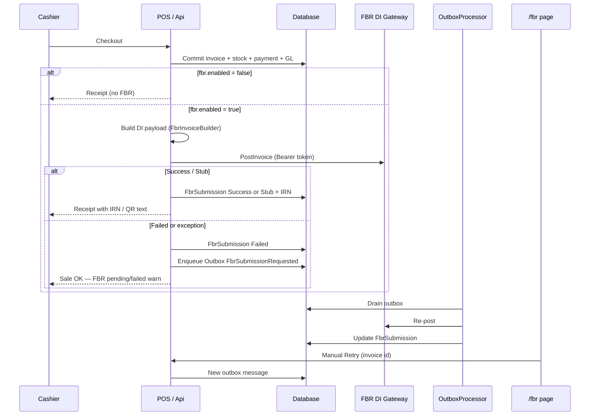

# FBR Digital Invoicing — Integration Guide

**Audience:** Business ops + technical teams  
**Scope:** What is **already implemented** in Car Auto Parts ERP/POS for Pakistan FBR Digital Invoicing (DI)  
**Related:** [FBR-PRODUCTION.md](FBR-PRODUCTION.md) (sandbox → production cutover) · [DEPLOYMENT.md](DEPLOYMENT.md) · [PILOT-RUNBOOK.md](PILOT-RUNBOOK.md) · [adr/002-transactional-outbox.md](adr/002-transactional-outbox.md)

---

## 1. What this integration does

After a POS sale is saved, the system can **post the invoice to FBR’s Digital Invoicing gateway** so the shop stays tax-compliant.

| Principle | Behavior |
|-----------|----------|
| Sale first | Invoice + stock + payment + GL commit **before** FBR |
| Non-blocking | FBR failure **never voids or rolls back** the sale |
| Retryable | Failed posts are recorded and can be retried from `/fbr` and/or outbox |
| Optional | Controlled by module `sales.fbr` and behavior `fbr.enabled` |

**Who needs it:** Auto-parts / bike-parts profiles enable FBR by default. General retail usually leaves it off unless the shop is enrolled for DI.

---

## 2. End-to-end flow (as implemented)



### Step-by-step

1. Cashier completes checkout on **POS** (`/pos`).
2. API runs one business transaction: **sales invoice**, stock movements, tender/payment, and GL.
3. That transaction **commits**.
4. If `behavior.fbr.enabled` is false → stop (no FBR call).
5. If enabled → `FbrInvoiceBuilder` builds the DI JSON from the invoice + company (NTN, address, buyer, lines, tax, scenario).
6. `FbrService` posts to:
   - Sandbox: `https://gw.fbr.gov.pk/di_data/v1/di/postinvoicedata_sb`
   - Production: `https://gw.fbr.gov.pk/di_data/v1/di/postinvoicedata`
7. **Empty Bearer token** → **stub mode** (IRN like `TEST-…`) for demos — **not** production compliance.
8. Result stored as `FbrSubmission` (`Success` / `Stub` / `Failed`) with request/response JSON.
9. On failure → outbox message type `FbrSubmissionRequested` for background retry; cashier still gets a successful sale.
10. Receipt shows IRN when Success/Stub; otherwise warns to reprint after retry.
11. Ops monitor **`/fbr`**: metrics, history, **Retry**.

---

## 3. Complete integration inventory (shipped)

### 3.1 Core services

| Component | Role |
|-----------|------|
| `PosCheckoutService` | Post-commit FBR call; never fails the sale on FBR errors |
| `FbrInvoiceBuilder` | Maps sales invoice → FBR DI request DTO |
| `FbrService` (`Infrastructure/Fbr`) | HTTP client, stub when no token, sandbox/prod URL |
| `FbrOutboxService` / `OutboxWriter` | Enqueue `FbrSubmissionRequested` |
| `OutboxProcessor` | Background drain (~seconds); re-posts FBR |
| `EnterpriseSalesService` | Submission list + metrics |
| `ReportService` | FBR register report |

### 3.2 HTTP APIs

| Method | Path | Purpose |
|--------|------|---------|
| `POST` | `/api/fbr/invoices` | Direct DI post (feature + `pos.checkout`) |
| `GET` | `/api/enterprise/fbr/submissions` | Paged submission history (`/api/v1/...` also) |
| `GET` | `/api/enterprise/fbr/metrics` | Success / stub / failed / needs-retry |
| `POST` | `/api/enterprise/fbr/retry/{invoiceId}` | Enqueue manual retry (`202`) |
| `GET` | `/api/reports/fbr` | FBR register (JSON/Excel) |

All enterprise FBR routes are gated with `[RequireFeature(sales.fbr)]` and appropriate permissions.

### 3.3 User interfaces

| Screen | What you can do |
|--------|-----------------|
| **`/pos`** | Buyer / FBR scenario fields; after sale see IRN or pending/failed + link to FBR |
| **`/fbr`** | Metrics, history, test post, **Retry** for failed/pending |
| **Dashboard** | FBR success % and needs-retry signals |
| **Settings / Onboarding** | Enable FBR behavior; sandbox flag (onboarding); company NTN / POS Id |
| **Reports** | FBR register; period-close can warn on FBR backlog |
| **Desktop (WPF)** | Parallel FBR client + **QR image** on printed receipt |

### 3.4 Data model

**Status enum (`FbrSubmissionStatus`)**

| Value | Meaning |
|-------|---------|
| `Pending = 0` | Awaiting / retryable |
| `Success = 1` | Accepted by FBR with IRN |
| `Failed = 2` | Post failed — retry |
| `Stub = 3` | Local TEST IRN (no real gateway token) |

**`FbrSubmission` (1:1 with `SalesInvoice`)**

- `SalesInvoiceId`, `FbrInvoiceNumber` (IRN)
- `Status`, `RequestJson`, `ResponseJson`, `ErrorMessage`, `SubmittedAt`

**Outbox**

- `OutboxMessage.Type = FbrSubmissionRequested`
- Payload references sales invoice (+ optional request JSON)
- See ADR-002 for transactional outbox design

**Metrics**

- Counts: Success, Stub, Failed, Pending, Total  
- `SuccessRatePercent` = (Success + Stub) / Total × 100  
- `NeedsRetryCount` = Failed + Pending  

### 3.5 Configuration

**Appsettings / environment (`Fbr` section)**

| Setting | Purpose |
|---------|---------|
| `UseSandbox` | Default sandbox vs production URL |
| `PostInvoiceUrlSandbox` / `PostInvoiceUrlProduction` | DI gateway URLs |
| `BearerToken` | DI API token (`Fbr__BearerToken` in env — **never commit**) |
| `TimeoutSeconds` | HTTP timeout (default 60s in options) |

**Company settings**

| Field | Purpose |
|-------|---------|
| NTN, name, address, city/province | Seller identity on payload / ops |
| `PosId` | POS identity (ops / desktop receipt) |
| `FbrUseSandbox` | Overrides appsettings for which URL is used |

**Feature flags**

| Flag | Effect |
|------|--------|
| Module `sales.fbr` | Shows FBR nav / API feature gate |
| Behavior `fbr.enabled` | Actually posts after POS checkout |

### 3.6 Observability & ops

| Signal | Where |
|--------|--------|
| History / retry | Web `/fbr` |
| Metrics API | `GET .../fbr/metrics` |
| Outbox health | `GET /health/ready` (stale processor / backlog) |
| Smoke scripts | `scripts/smoke-api-waves.ps1` (metrics/submissions/register) |
| Cutover playbook | [FBR-PRODUCTION.md](FBR-PRODUCTION.md) |

**Stage 0 target:** &gt;99% success where FBR is enabled (after retries).

### 3.7 Receipt / QR

| Client | Behavior |
|--------|----------|
| **Web POS** | Shows IRN; QR payload as text `FBR-IRN:{irn}\|TOTAL:{amount}` (not a drawn QR bitmap) |
| **Desktop WPF** | Prints QR image (QRCoder) with IRN |

---

## 4. Business operating rules

1. **Never void a sale only because FBR failed** — fix token/URL/NTN and use **Retry** on `/fbr`.  
2. **Stub IRNs** (`TEST-…`) are for lab/demo when the token is empty — not for go-live.  
3. Before production: complete sandbox sales, then follow [FBR-PRODUCTION.md](FBR-PRODUCTION.md).  
4. Period close may **warn** if FBR backlog remains — clear retries first.  
5. Wrong environment (sandbox token on production URL) → flip settings, restart API, retry failures.

---

## 5. Technical notes for developers

### Non-rollback contract (do not break)

```text
1. Commit checkout unit of work (invoice + stock + payment + GL)
2. THEN call FBR
3. On any FBR failure/exception → persist Failed + enqueue outbox; still return sale success to client
```

Covered by integration tests such as `Fbr_failure_enqueues_outbox` and `Fbr_throw_does_not_roll_back_sale` (may depend on open accounting-period fixtures).

### Key source files

| Path | Purpose |
|------|---------|
| `Application/Services/PosCheckoutService.cs` | Post-commit FBR orchestration |
| `Application/Services/FbrInvoiceBuilder.cs` | Payload builder |
| `Application/DTOs/Fbr/FbrDtos.cs` | Request/result DTOs |
| `Infrastructure/Fbr/FbrService.cs` | HTTP + stub |
| `Infrastructure/Fbr/FbrOptions.cs` | Config binding |
| `Infrastructure/Services/FbrOutboxService.cs` | Enqueue retry |
| `Infrastructure/Services/OutboxProcessor.cs` | Background worker |
| `Api/Controllers/FbrController.cs` | `POST /api/fbr/invoices` |
| `Api/Controllers/EnterpriseController.cs` | Submissions / metrics / retry |
| `Web/Pages/Fbr.razor` | Ops UI |
| `Domain/Entities/SalesEntities.cs` | `FbrSubmission` |
| `PosWpf/Services/FbrService.cs` | Legacy desktop DI client |

### Extending carefully

- Wholesale / delivery invoices and **credit notes** are **not** on the DI path today — only **POS checkout**.  
- Company `FbrBearerToken` column exists but posting uses **appsettings/env token**.  
- Validate-DI URLs in sample config are **not wired** into `FbrService` yet.

---

## 6. What is **not** implemented (honest gaps)

| Gap | Notes |
|-----|--------|
| IRIS portal integration | Not in this codebase |
| DI validate API | URLs may appear in config; unused by client |
| FBR on wholesale / delivery / returns | POS checkout path only |
| Formal dead-letter queue | Outbox error fields + manual retry; no max-attempt DLQ UI |
| Scannable QR image on Web receipt | Text payload; desktop has image |
| Full Settings UI for every FBR company field | Some fields via onboarding / API; see production doc |

---

## 7. Quick start checklist

### Lab / demo

1. Enable `sales.fbr` + `fbr.enabled`.  
2. Leave Bearer empty → expect **Stub** submissions.  
3. Sell on POS → open `/fbr` → see Stub/Success.  

### Production

1. Enroll seller with FBR; obtain production Bearer.  
2. Set company NTN / address / POS Id.  
3. Run sandbox sales with real sandbox token.  
4. Follow [FBR-PRODUCTION.md](FBR-PRODUCTION.md) cutover.  
5. Monitor metrics and `/health/ready`.  

---

*Document version: 2026-08-03 — describes the FBR DI integration as implemented in this repository.*
