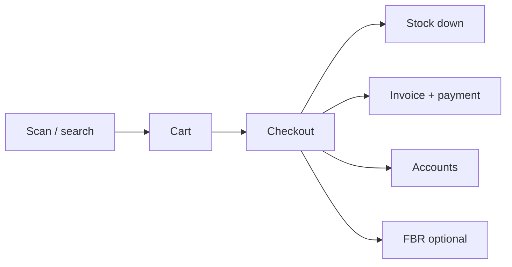
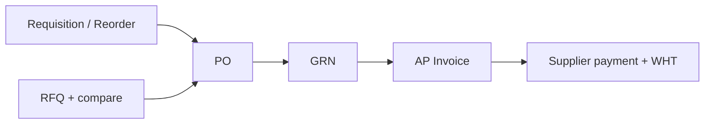

# Business Guide — Car Auto Parts ERP / POS

**Audience:** Business owners, store managers, sales heads, finance managers, and operations supervisors  
**Language:** Plain English — no code required  
**Product:** Configurable mid-market ERP + POS for auto parts, bike parts, and general retail (Pakistan / South Asia focus, FBR-ready)

---

## 1. What this software is

Car Auto Parts is an **all-in-one shop system**. One install can run as:

- **Auto parts** store / wholesaler  
- **Bike parts** shop  
- **General retail** (e.g. stationery and similar)

You turn modules on or off and adjust labels through **business profiles** — you do not need a separate product for each industry.

It covers the counter, stock, purchasing, customers, light sales CRM, service tickets, and accounting — so sales, warehouse, and accounts work from the **same numbers**.

---

## 2. Who uses what

| Role | Typical daily use |
|------|-------------------|
| **Cashier / counter** | POS sales, holds, shifts, returns |
| **Salesperson** | Leads, pipeline, quotations, customer follow-ups, targets |
| **Store / warehouse** | Stock, transfers, GRN, cycle counts, serials |
| **Purchaser** | Requisitions, POs, RFQ compare, supplier payments |
| **Accounts** | Journals, periods, bank recon, aging, cash flow, WHT |
| **Service desk** | Customer service tickets, warranty/AMC notes |
| **Owner / manager** | Dashboard, reports, approvals, users & permissions, settings |

Access is controlled by **roles and permissions**. Staff only see menus they are allowed to use. Multi-branch shops can limit users to their branches.

---

## 3. End-to-end business flows

### 3.1 Sell at the counter (POS)

1. Open **POS** → search product (name / barcode / OEM fitment where configured).  
2. Add lines → choose customer (walk-in or account).  
3. Take payment: Cash / Card / Bank / Credit.  
4. System posts **sale + stock deduction + accounts** together.  
5. Optional **FBR** e-invoicing: if FBR fails, the **sale still stands** (you can retry FBR separately). Details: [FBR-INTEGRATION.md](FBR-INTEGRATION.md).  
6. Shift open/close (Z/X style) and held sales for busy counters.

**Manager tip:** Use keyboard shortcuts (search, add, checkout) for speed. Credit sales need customer credit limit discipline.

---

### 3.2 Quote → order → deliver → invoice (wholesale / B2B)

1. Create **Quotation** for a customer.  
2. Convert to **Sales Order**.  
3. Create **Delivery** (pick / ship).  
4. Raise **Invoice** from order or delivery.  
5. Collect payment on **Receipts**; watch **Aging**.

CRM **opportunities** can link to a quotation so sales forecasts stay tied to real quotes.

---

### 3.3 Buy stock (purchasing)

1. **Reorder** suggestions or manual **Requisition**.  
2. Approve → **Purchase Order**.  
3. Optional **RFQ**: send request → collect vendor quotes → **compare prices** → create / link PO.  
4. **GRN** (goods receipt) → quality / put-away as configured.  
5. **AP invoice** → match → pay supplier (with optional **withholding tax** for Pakistan B2B).

---

### 3.4 Stock & warehouses

- Multiple **warehouses** and **bin locations**.  
- **Transfers** between warehouses (including inter-branch / in-transit).  
- **Cycle counts**, adjustments, **serial numbers**, reservations.  
- Kits / bill-of-materials light for bundled parts.  
- Mobile **stock check** (phone browser); optional camera barcode on supported phones.

**Manager tip:** Transfers and counts need clear ownership so physical stock matches the system.

---

### 3.5 Customers, credit & collections

- Customer master with credit limit and balance.  
- Commission % can be stored on the customer for sales reporting.  
- **Aging** and receipts for collections.  
- **Customer 360** (CRM): one screen for balance, profitability estimate, invoices/orders/returns, activities, opportunities, and service tickets.

---

### 3.6 Light CRM (leads → customers → deals)

Designed for shop sales teams — **not** Salesforce marketing automation.

| Step | What you do |
|------|-------------|
| 1 | Capture a **Lead** (name, phone, source, owner). |
| 2 | Update status: New → Contacted → Qualified → Lost / Converted. |
| 3 | System warns on **duplicate** phone/email/name. |
| 4 | **Convert to Customer** (once; safe to retry). |
| 5 | Open an **Opportunity** on the **Pipeline** board (Prospect → Quoted → Negotiation → Won / Lost). |
| 6 | Track **Tasks** (My day / overdue / calendar); notifications when assigned. |
| 7 | Use **Customer 360** after conversion for history and AR. |

Optional: assignment rules by lead source, lead score, email **template copy** (sending via company email comes later).

---

### 3.7 Service Light (after-sales)

1. Open a **Service Ticket** for a customer (priority, description).  
2. Mark warranty / AMC as a **note** when needed (simple reference — not a full contract module).  
3. Move status: Open → In progress → Resolved → Closed (resolution notes required to close).  
4. Work tickets on **desktop** or **mobile** (`/m/service`).  
5. See related tickets on **Customer 360**.  
6. Optional: look up **Knowledge Base** articles (`Service → Knowledge Base`) while working a ticket.

**SLA (Web):** Configure policies, routing rules, and review the breach queue under **Service → SLA**. Ticket timers start on create (optional policy override). Thin ops clocks also run on selected docs (open SO, unpaid invoice, stuck GRN/AP, low stock) — not on POS lines or journals. WPF/POS does **not** manage SLA. Matrix: [PRODUCT-POSITIONING.md](PRODUCT-POSITIONING.md) · [SLA-EXPANSION.md](SLA-EXPANSION.md). CRM **tasks** use due dates (optional one-shot DueAt warn) — they are **not** Service SLA policies.

**Honest limit:** Light SLA (tickets + thin ops clocks) + internal KB stub shipped — still no technician dispatch map or customer self-service portal.

---

### 3.8 Finance & compliance

- Chart of accounts, **accounting periods**, journals.  
- Customer receipts / supplier payments.  
- **Bank reconciliation** (match statement lines to ledger).  
- **Cash flow** report.  
- Trial balance, P&amp;L, balance sheet style financial reports.  
- Opening balances, account mappings for automated postings.  
- Approvals for sensitive actions; full **audit** trail.

---

### 3.9 People, branches & control

- Users, roles, permissions.  
- Branch access control.  
- Approvals inbox (desktop + mobile).  
- Backups (real database backup — not a fake file).  
- First-run **onboarding** wizard.  
- English / Urdu labels where localized.

---

## 4. Feature map (menus)

| Area | What you get |
|------|----------------|
| **Dashboard** | Snapshot of business activity |
| **Catalog** | Products, categories, brands, kits, price lists, barcodes |
| **Inventory** | Stock, warehouses, movements, serials, reservations, cycle counts, transfers |
| **Partners** | Suppliers, customers, aging, receipts |
| **Purchasing** | POs, requisitions, reorder, GRN, AP invoices, RFQ |
| **Sales** | POS, quotations, orders, deliveries, invoices, returns, FBR, sales targets |
| **CRM** | Leads, tasks, pipeline, CRM settings |
| **Service** | Service tickets |
| **Finance** | Company, COA, journals, periods, opening balances, bank recon, cash flow, reports, mappings |
| **Reports / insights** | Daily sales, stock, staff, margins, tax/FBR registers, analytics |
| **Admin** | Users, roles, settings, modules, onboarding, audit, notifications |
| **Mobile** | Stock check, approvals, CRM tasks, service tickets |

---

## 5. Day-in-the-life examples

**Busy counter morning**  
Open shift → sell on POS → hold a sale for a customer who stepped out → close with Z report → check low stock on mobile.

**Outside salesperson**  
Create lead from WhatsApp inquiry → qualify → convert to customer → create opportunity → send quotation → move pipeline to Quoted → complete follow-up task.

**Purchasing weekly**  
Review reorder → raise RFQ to three vendors → compare → raise PO → GRN on arrival → post AP → pay with WHT.

**Month end (accounts)**  
Bank recon → aging chase → cash flow review → close period when checklists pass.

---

## 6. What this product is *not* (yet)

Say this clearly to stakeholders so expectations stay honest:

- Not SAP / Dynamics / full Odoo replacement  
- Not deep HR / payroll or manufacturing MRP  
- Not marketing automation / multi-pipeline Salesforce  
- Not multi-day offline “store runs without server”  
- Not full field-service (portals, scheduling, dispatch) — light Web SLA on tickets only; no WPF SLA screens  

- Not a native App Store app (mobile is browser-based)

Roadmap for later growth is tracked for product/tech teams; ask them for timelines before promising customers.

---

## 7. Getting value quickly (checklist for owners)

1. Finish **onboarding** (company, profile, tax, FBR if needed).  
2. Load **products** and opening **stock**.  
3. Set **users/roles** (cashier vs manager).  
4. Train counter on **POS** only first week.  
5. Turn on **CRM** when sales team is ready for leads.  
6. Use **approvals** for discounts/voids if policy requires.  
7. Review **dashboard + aging** weekly; **cash flow + bank recon** monthly.

---

## 8. Where to get help inside the org

| Need | Ask |
|------|-----|
| Login / permissions | Admin user |
| How a screen works | This guide + in-app menus |
| Install, LAN, FBR go-live | Technical team → [DEPLOYMENT.md](DEPLOYMENT.md) |
| What we officially claim to customers | [PRODUCT-POSITIONING.md](PRODUCT-POSITIONING.md) |

---

*Document version: 2026-08-07 — reflects CRM light, ops gaps, Service Light + light SLA (tickets only; see PRODUCT-POSITIONING).*
