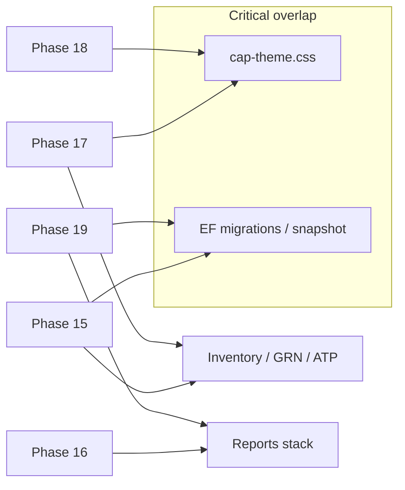

# Phase completion plan — finish Stages 0–2 product

Practical plan to **complete** remaining Phases **14–21** without restarting parallel epics. Docs only — not a feature implementation guide.

Related: [ROADMAP-TO-TOP-TIER.md](ROADMAP-TO-TOP-TIER.md) · [CHANGELOG-ENTERPRISE.md](CHANGELOG-ENTERPRISE.md) · [CLIENT-REPORTS-ROADMAP.md](CLIENT-REPORTS-ROADMAP.md) · [PERFORMANCE.md](PERFORMANCE.md)

**Snapshot date:** 2026-07-31 (workspace after parallel agents for 14–19; verify with `dotnet test` + changelog before treating any “in flight” row as Done).

---

## 1. Current snapshot (Phases 0–21)

| Phase | Focus | Status | Evidence / notes |
|-------|--------|--------|------------------|
| **0–11** | Enterprise foundation | **Done** | Changelog through Phase 11 |
| **12 / 12.1 / 12.2** | Counter · FBR · pilot | **Done** (P0+P1) | Open: formal 50k SKU p95 note; GTM P2 deferred |
| **13** | Catalog depth | **Done** (P0+P1) | Open: cross-ref maintenance UI (Q1 P1) |
| **14** | Wholesale loop | **Done** (P1+P2 product) | Changelog + `Phase14WholesaleLoopTests`; B2B quote PDF deferred |
| **15** | Warehouse locations | **In flight** | Migration `Phase15WarehouseLocations`, domain + `LocationBalanceSync`, DTO hooks; **not** yet wired end-to-end in GRN/cycle/pick UI; no `Phase15*` tests |
| **16** | Report cadence | **Done** (Q4 P1) | PDF ACL + Z Excel + `Phase16ReportCadenceTests`; email packs / week pack deferred |
| **17** | Mobile light | **In flight** | `/m`, `MobileStock`, `MobileApprovals`, nav + `.cap-m-*` CSS; no PWA/manifest; no dedicated tests |
| **18** | Design system | **In flight** | `cap-theme.css` tokens, `PageHeader`, `EmptyState`; sparse empty-state adoption; **no** guided tour |
| **19** | Performance budgets | **In flight** | [PERFORMANCE.md](PERFORMANCE.md), `Phase19ReportAndPosIndexes`, `QueryLimits` / date caps; smoke **timings not yet** in `smoke-money-path.ps1`; no `Phase19*` / `ReportDateRangeTests` yet |
| **20** | Extended offline | **Not started** | Still max 100 / 24h in `offline-outbox.js` |
| **21** | Help & locale | **Not started** | LocaleService exists; no in-app help / what’s-new / cashier EN-UR parity epic |

**Legend**

- **Done** = P0 (and claimed P1) acceptance met enough to ship; deferred stretch items listed in roadmap stay deferred.
- **In flight** = code/docs already in tree from parallel agents; treat as incomplete until Wave B green + Wave C gap-fill.
- **Not started** = do not begin until Wave B gate (see §3 / §6).

---

## 2. Conflict risk map

Parallel 14–19 touch overlapping surfaces. Highest risk first.

| Shared surface | Phases | Risk | Reconcile note |
|----------------|--------|------|----------------|
| `wwwroot/css/cap-theme.css` | **17, 18** (+ incidental 14/16 UI) | **Critical** | Single owner after Wave A; merge tokens first, then mobile rules under `--cap-*` |
| EF migrations + `ApplicationDbContextModelSnapshot` | **15, 19** (+ any late 14 schema) | **Critical** | Order migrations by timestamp; never invent parallel snapshot edits — rebase one chain |
| Inventory / GRN / cycle / ATP / transfers | **15** (primary), **17** (read stock), **19** (query shape) | **High** | 15 owns write path + location dimension; 17/19 consume only |
| `ReportService` / `PdfReportService` / `Reports.razor` | **16, 19** | **High** | 16 owns ACL/export behavior; 19 owns indexes, caps, timing — don’t re-scope ACL in 19 |
| `Pos.razor` / `PosCheckoutService` / product search | **12** (done), **18, 19** | **Medium** | 18 polish only; 19 measure/index — avoid search semantics churn |
| `EnterpriseSalesService` + wholesale pages | **14** (done), touch risk if 18 restyles | **Low–Med** | Freeze wholesale behavior in Wave C; CSS-only OK |
| `NavDefinition.cs`, `Permissions.cs`, `CapApiService` | **14–17** | **Medium** | One integrate pass for nav/API client after Wave A |
| `Approvals.razor` + mobile approvals | **17, 6** | **Medium** | Keep desktop + `/m/approvals` behavior aligned |
| `offline-outbox.js` | **10** (done), **20** (later) | **Low now** | Freeze until Wave D |



---

## 3. Recommended sequence to COMPLETE (not restart)

### Wave A — Let 14–19 land; freeze new phases

1. Allow in-flight agents/PRs for **14–19** to merge (or finish local worktrees).
2. **Stop-start rule:** do **not** launch Phase **20** or **21** (see §6).
3. Do **not** open Stage 4 cloud work or new Stage 3 product features from this queue.
4. Tag/branch tip after Wave A as `pre-reconcile-14-19` for easy bisect.

### Wave B — Integration reconcile (build + test green)

1. Resolve **CSS** (17 vs 18) and **migration** (15 vs 19) conflicts first.
2. `dotnet build` solution; `dotnet test` on `CarAutoParts.Application.Tests`.
3. Run `scripts/smoke-money-path.ps1` against a fresh API (fix MFA escape if needed).
4. Fix compile/test/smoke only — **no new epic scope**.
5. Exit gate: **green build + green tests + smoke PASS** on one clean tree.

### Wave C — Gap-fill 14–19 to P0 acceptance

Work **serially by risk**, not in parallel:

| Order | Phase | Gap-fill focus |
|-------|--------|----------------|
| C1 | **15** | Finish P0: bin master UI, putaway on receive, location-aware cycle count, ATP policy doc; wire `LocationBalanceSync` into post paths; add `Phase15*` tests |
| C2 | **16** | Confirm Q4 P1 still green after 15/19 merges; do **not** pull email packs into this wave unless trivial |
| C3 | **17** | Phone-usable stock + approvals; branch-scoped; responsive; optional thin PWA later — meet Q1/Q2 P2 acceptance |
| C4 | **18** | Tokens + empty states on POS / Reports / Settings demo path; tables/forms consistency; defer guided tour if timeboxed |
| C5 | **19** | Add smoke **elapsed ms** for POS search + day sales; ensure indexes applied; document pass/fail vs [PERFORMANCE.md](PERFORMANCE.md) |
| C6 | **14** | Regression only (happy path + credit limit); B2B PDF stays deferred |

Also close obvious **Done-phase leftovers** only if they block demos: Phase 12 p95 note can ride with C5.

### Wave D — Phase 20 Extended Offline

Only after Wave B green **and** Wave C P0 for **15 + 19** (inventory + counter budgets stable).

- Larger / multi-day queue policy + conflict rules
- Shift close remains safe with pending queue
- Document limits in PRODUCT-POSITIONING + DEPLOYMENT

### Wave E — Phase 21 Help & Locale

After Wave D **or** in parallel with D **only if** no shared CSS/JS owners conflict (prefer after D).

- In-app help links on cashier/finance critical screens
- EN/UR parity on POS + finance blockers
- Support portal + “what’s new” from changelog highlights (P1)

### Wave F — Stage exit checklist (metrics that aren’t code)

Product code alone does **not** exit Stages 0–2. Track outside the repo:

| Stage | Non-code exits |
|-------|----------------|
| **0** | 15+ live shops plan; &lt;2 critical bugs/month owner; FBR success &gt;99% measured in prod; onboarding without on-site engineer |
| **1** | ≥80% daily dealer workflow matrix vs Rev/local; quote→invoice + bin ops in ≥3 / ≥1 pilots; managers use report packs |
| **2** | Demo win rate &gt;40%; NPS &gt;40; performance budgets green in real pilot hardware |

Assign a **human owner** + spreadsheet; update [PRODUCT-POSITIONING.md](PRODUCT-POSITIONING.md) only when metrics are met.

---

## 4. Per-phase definition of done (tightened)

Acceptance from roadmap, narrowed to shippable P0/P1. Deferred items stay explicit.

### Phase 14 — Wholesale loop *(mostly Done)*

- [x] Quote → SO → Delivery → Invoice in Web without API tools
- [x] Credit limit enforced on SO convert / invoice post with clear errors
- [x] Document chain visibility + nav links
- [x] Price source visible on quote lines; override permission-gated
- [ ] **Deferred:** B2B quote PDF / WhatsApp share
- **Regression DoD:** `Phase14WholesaleLoopTests` green after Wave B

### Phase 15 — Warehouse locations *(In flight → complete)*

- [ ] Bin/location CRUD on warehouse (code + name + receiving/pick defaults)
- [ ] `InventoryLocationBalance` stays consistent on receive/putaway/adjust
- [ ] GRN/receive assigns bin (or receiving-default); documented ATP policy (warehouse-level vs bin-level)
- [ ] Cycle count by bin/location + variance post
- [ ] **P1:** Pick list for delivery / inter-branch transfer before ship
- [ ] Tests: `Phase15WarehouseLocationsTests` (putaway + count + default bin)
- [ ] Changelog entry when P0 met

### Phase 16 — Report cadence *(Q4 P1 Done)*

- [x] PDF branch ACL parity with Excel (inventory/sales/purchases)
- [x] Z archive optional Excel
- [ ] **Deferred P1:** Scheduled email packs (daily sales + Z) with branch ACL + opt-in
- [ ] **Deferred P2:** Manager PDF week pack
- **Regression DoD:** `Phase16ReportCadenceTests` green after merges

### Phase 17 — Mobile light *(In flight → complete)*

- [ ] Read-only stock check on phone (branch-scoped)
- [ ] Approvals inbox: approve/reject PO (or pending requests) on phone
- [ ] Low-stock visibility on mobile (Q2 P1)
- [ ] Uses `--cap-*` tokens (no parallel mobile theme)
- [ ] **Not required for DoD:** native apps; full ERP on mobile
- [ ] **Deferred decision:** light B2B portal vs Stage 4

### Phase 18 — Design system *(In flight → complete)*

- [ ] Shared tokens in `cap-theme.css` documented for contributors
- [ ] Consistent `PageHeader` / tables / forms on **POS + Reports + Settings**
- [ ] Empty states on those demo surfaces (no dead-end blanks)
- [ ] Demo script can stay on polished surfaces only
- [ ] **P0 later / Q3:** Guided tour / first-run tips for Cashier & Accountant — may trail if Wave C timebox hits

### Phase 19 — Performance *(In flight → complete)*

- [ ] Budgets written ([PERFORMANCE.md](PERFORMANCE.md)) — present
- [ ] Hot-path indexes applied (`Phase19ReportAndPosIndexes` + Phase 12 OEM/part)
- [ ] Smoke (or script) prints elapsed ms for POS search + day sales; compared to &lt;2s / &lt;3s warm targets
- [ ] Interactive/export date caps enforced
- [ ] **Deferred:** full APM, k6 CI, formal 50k lab on dedicated hardware (link from Phase 12 open item)

### Phase 20 — Extended offline *(Not started)*

- [ ] Policy beyond 100 / 24h with documented conflict rules
- [ ] Shift close still blocked or safe with pending/failed queue
- [ ] Single-branch GA path; multi-branch offline rules documented
- [ ] PRODUCT-POSITIONING updated (no longer “short outage only” if GA)

### Phase 21 — Help & locale *(Not started)*

- [ ] In-app help links on POS + finance critical paths
- [ ] No English-only blockers on cashier path (EN/UR)
- [ ] Support portal link + in-app what’s-new from changelog highlights

---

## 5. Suggested calendar

### Aggressive — 2–3 week engineering sprint

Assumes agents already landed most of 14–19 and one engineer owns reconcile.

| Days | Wave | Outcome |
|------|------|---------|
| 0–2 | A→B | Freeze 20/21; merge/reconcile; build+test+smoke green |
| 3–7 | C1–C2 | Phase 15 P0 + 16 regression |
| 8–11 | C3–C5 | 17 + 18 demo path + 19 smoke timings |
| 12–14 | Buffer | Bugfix; changelog; demo script |
| *After sprint* | D→E | 20 then 21 (not inside the 2–3 week box unless 15/19 already rock-solid) |
| Ongoing | F | Metrics / pilots (not engineering-only) |

**Risk:** Aggressive calendar **fails** if Phase 15 pick/putaway is deeper than expected — cut P1 pick list to follow-up rather than slipping Wave B freeze.

### Realistic — quarter alignment (roadmap)

| Window | Focus |
|--------|--------|
| **Now / residual Q3–Q4 2026** | Waves A–B; close 14/16; push 15 P0 |
| **Q1 2027** | Phase 15 finish + 16 email packs + 17 mobile; 13 cross-ref UI |
| **Q2 2027** | Phase 18–19 P0; start 20–21; Stage 1 checklist scored |
| **Q3–Q4 2027** | Stage 2 exit: tours, offline GA, locale/help, demo win + NPS |

Use the aggressive sprint only for **reconcile + P0 gap-fill**; use quarters for deferred P1/P2 and Wave F metrics.

---

## 6. Stop-starting rule

> **Do not launch Phase 20 or Phase 21 until Phases 14–19 build green on one integrated tree (Wave B exit).**

Clarifications:

1. “Build green” = solution build + Application.Tests + smoke money-path PASS.
2. Gap-fill (Wave C) may continue **after** Wave B; that is finishing 14–19, not starting 20/21.
3. Exception only if a **production pilot is blocked** by offline duration or locale — then spike a **minimal** fix under Phase 10/8, not a full Phase 20/21 epic.
4. Do not start Stage 4 (cloud/multi-tenant) from this completion queue.

---

## 7. Owner checklist (copy/paste)

```text
[ ] Wave A: 14–19 landed; 20/21 not started
[ ] Wave B: CSS + migrations reconciled; build/test/smoke green
[ ] Wave C: 15 P0 · 16 regression · 17 phone path · 18 demo surfaces · 19 timed smoke
[ ] Wave D: Phase 20 extended offline + docs
[ ] Wave E: Phase 21 help + locale parity
[ ] Wave F: Stage 0–2 exit metrics owned outside code
[ ] CHANGELOG-ENTERPRISE.md updated per phase close
[ ] ROADMAP progress checkboxes updated
```

---

## Document history

| Date | Change |
|------|--------|
| 2026-07-31 | Initial completion plan (parallel 14–19 reconcile → 20 → 21 → stage metrics) |
