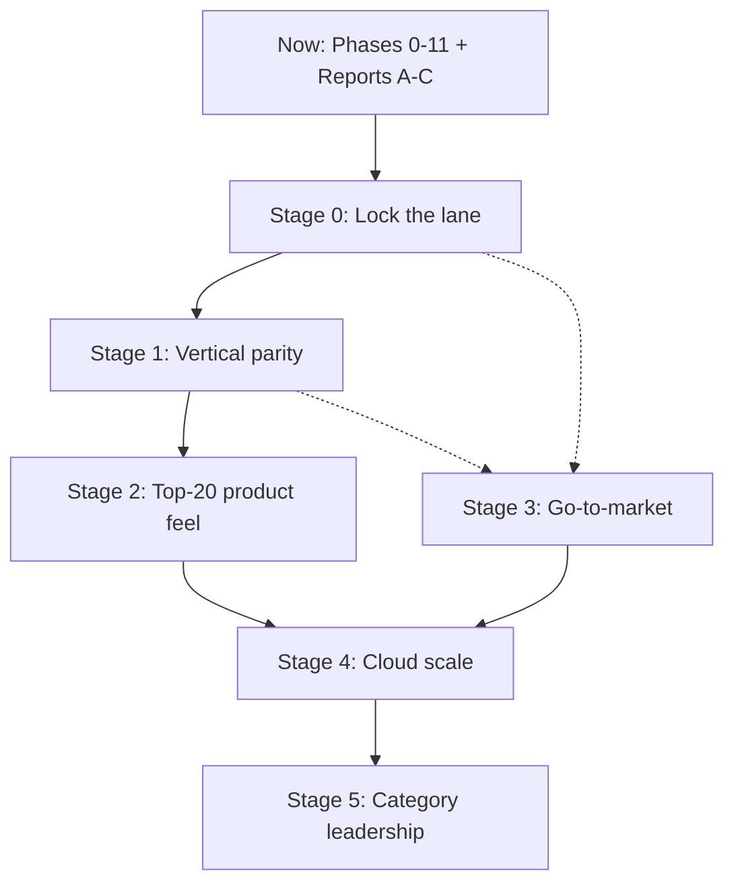
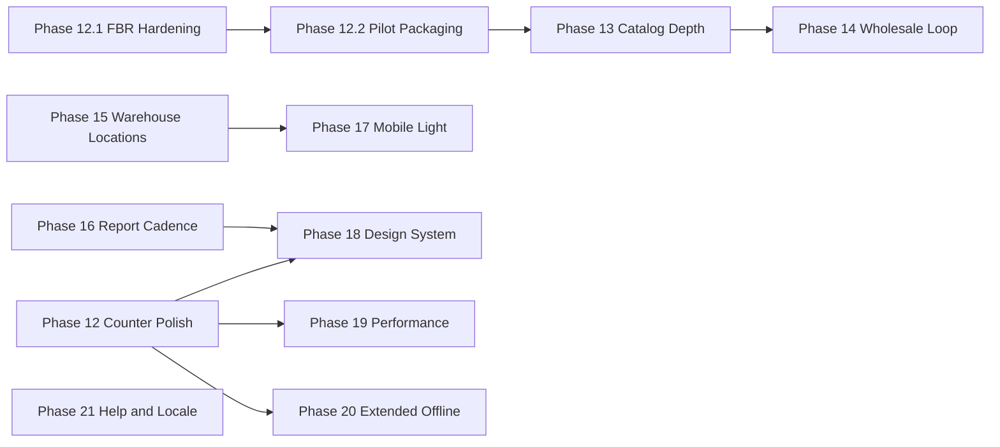

# Roadmap — climb to top-tier (niche)

Formal product plan to reach **top 10–20 in our lane**, not a NetSuite/SAP clone.

**Lane:** Pakistan / South Asia **auto parts, bike parts, and general retail** — multi-branch ERP + POS with FBR where required.

Related docs: [PRODUCT-POSITIONING.md](PRODUCT-POSITIONING.md) · [MASTER-ROADMAP.md](MASTER-ROADMAP.md) · [CHANGELOG-ENTERPRISE.md](CHANGELOG-ENTERPRISE.md) · [VERTICAL-PROFILES.md](VERTICAL-PROFILES.md) · [CLIENT-REPORTS-ROADMAP.md](CLIENT-REPORTS-ROADMAP.md) · [DEPLOYMENT.md](DEPLOYMENT.md) · [PERFORMANCE.md](PERFORMANCE.md) · [PHASE-COMPLETION-PLAN.md](PHASE-COMPLETION-PLAN.md)

---

## Completion plan

**How to finish remaining product phases** (not restart them): see **[PHASE-COMPLETION-PLAN.md](PHASE-COMPLETION-PLAN.md)**.

Short version: let parallel **14–19** land → reconcile build/test (CSS + migrations) → gap-fill each to P0 → only then **20** Extended Offline → **21** Help & Locale → Stage exit metrics (pilots/NPS/FBR) outside code. **Do not start 20/21 until 14–19 are green on one tree.**

---

## Executive summary

Car Auto Parts is already a **configurable mid-market ERP/POS** (Phases 0–11 + client Reports A–C). Winning “that level” means dominating a **narrow market**:

| Win by | Not by |
|--------|--------|
| FBR + counter speed + multi-branch parts ops | Copying every NetSuite module |
| Vertical depth (OEM/fitment/catalog UX) | Generic ERP feature count |
| Pilots, packaging, support SLAs | Features with no installs |
| Honest go-to-market language | “Market masterpiece” claims |

**Strategy in one line:** Lane dominance → vertical depth + polish → sales/support machine → cloud scale → brand/proof.

Enterprise Phases **0–11** remain the foundation. This roadmap continues numbering as **Phase 12+** epics under **Stages 0–5**.

---

## Current state snapshot (verified)

As of changelog through **2026-07-31**. Do not treat items below as incomplete unless listed under Known gaps.

### Shipped enterprise phases

| Phase | Focus | Status |
|-------|--------|--------|
| **0** | Baseline harden (password force, atomic POS checkout, LAN/CORS, FBR non-rollback) | Done |
| **1** | Shop floor (multi-tender, hold/recall, shifts/Z, returns GL, fitment search) | Done |
| **2** | Procurement (PR→PO, GRN tolerances/QC/serials, 3-way match, supplier returns, reorder) | Done |
| **3** | Inventory (ATP, negative-stock policy, transfer Ship→InTransit→Receive, supersession) | Done |
| **4** | Finance (opening balances, period-close checklist, thin bank recon, credit notes, tax/costing) | Done |
| **5** | Multi-branch (inter-branch GIT GL, shift variance, warehouse BranchId, branch dashboard) | Done |
| **6** | Governance (MFA/TOTP, approval matrix, audit, void-not-delete) | Done |
| **7** | Insights (dead/fast, GM%, valuation Avg/FIFO, stock alerts) | Done |
| **8** | Packaging (onboarding wizard, Cashier/Accountant templates, EN/UR, smoke/CI) | Done |
| **9** | Branch ACL + branch P&L/TB | Done |
| **10** | Counter resilience (short offline queue, multi-till, safe drops) | Done |
| **11** | Vertical profiles (`auto-parts` / `bike-parts` / `general-retail`) | Done |
| **12 / 12.1 / 12.2** | Counter polish · FBR hardening · pilot packaging (Stage 0 Q3) | Done (P0+P1; GTM P2 deferred) |
| **13** | Catalog depth (fitment UX, barcode/OEM search, OEM/fitment CSV) | Done (P0+P1; cross-ref UI Q1 P1) |
| **14** | Wholesale loop (quote → SO → delivery → invoice) | Done (P1+P2; B2B PDF Q1 P2 deferred) |
| **15** | Warehouse locations (bins, putaway, cycle count by bin, pick list) | Done (P0+P1) |
| **19** | Performance budgets (docs, indexes, day-sales aggregates, smoke timings) | Done (P0; formal 50k lab report deferred) |
| **18** | Design System (tokens, empty states, shell consistency) | Done (pragmatic P0; guided tour deferred) |
| **16** | Report cadence (PDF ACL + Z Excel) | Done (Q4 P1; email packs / week pack deferred) |
| **17** | Mobile Light (stock check + approvals on phone Web) | Done (P0 responsive + `/m`; Q2 branch-scoped P1 deferred) |

### Client reports (A–C)

Shipped: daily sales, Z archive, X-report, sales returns, sales dim/staff, profit dim, movements, PO/GRN pipeline, AR/AP aging Excel, analytics Excel, tax/GST, FBR register (module-gated), stock aging (best-effort), SKU margin, QuestPDF on key exports. See [CLIENT-REPORTS-ROADMAP.md](CLIENT-REPORTS-ROADMAP.md).

### Vertical profiles

Per-install modules/fields/behaviors/brand/labels via `AppConfigEntries` + Settings UI. See [VERTICAL-PROFILES.md](VERTICAL-PROFILES.md).

### Known gaps (honest)

- Offline = short outage queue (max 100 / 24h) — **not** multi-day store mode ([PRODUCT-POSITIONING.md](PRODUCT-POSITIONING.md))
- No scheduled report email packs (Q1 2027 Phase 16); manager week PDF pack deferred (Q2 P2)
- Single-tenant / install-first; not multi-tenant SaaS
- No deep ACES network catalog, cores program, or ecommerce B2B portal
- No runtime EAV custom fields; no HR/payroll/deep CRM

---

## Stage flow

Stages **0–2** are product execution (quarter backlog below). Stage **3** runs **in parallel** from month 0. Stages **4–5** are overview only until Stage 1–2 exit metrics are in sight.

### Capability snapshot (relative vs niche leaders)

Rough maturity only — not a feature audit score.

| Pillar | Now | Stage 2 target | Stage 5 target | Notes |
|--------|-----|----------------|----------------|-------|
| Vertical depth | Medium | High | Very high | OEM/fitment base; catalog-network still thin |
| Ops reliability | Good | High | Very high | Tills, short offline queue, branch ACL |
| Finance | Strong mid-market | Strong | Strong | GL/periods/aging shipped |
| Compliance (FBR) | Differentiator if solid | Rock-solid | Rock-solid + regional packs | Measure success % |
| UX polish | Largest product gap | Competitive | Top-tier feel | Phase 12 / 18–19 |
| Go-to-market | Product-led only | Early channel | Category player | Stage 3 parallel |
| Delivery model | Install / single-tenant | Packaged + pilots | Cloud SKU | Stage 4 |

### Dependency graph (product epics)

---

## Stages overview

### Stage 0 — Lock the lane (now → ~3 months)

**Goal:** Obvious #1 choice for PK/regional auto-bike-retail **multi-branch** dealers evaluating new systems.

**Exit metrics**

- 15+ live shops (paying or contracted pilots with real daily use)
- &lt;2 critical production bugs / month
- FBR success rate &gt;99% where enabled (post-commit + outbox retry measured)
- Onboarding completes without engineer on-site for single-branch default path

**Epic names:** Phase **12** Counter Polish · **12.1** FBR Production Hardening · **12.2** Pilot Packaging

### Stage 1 — Vertical parity (months 3–9)

**Goal:** Match Rev / strong local parts ERP on **daily dealer workflows** (not full NetSuite).

**Exit metrics**

- Checklist vs Rev/local ERP: **≥80%** of daily dealer workflows covered
- Quote→invoice and bin-aware receive/pick used in ≥3 pilot chains
- Managers run week-close from in-app report packs (not spreadsheet rebuilds)

**Epic names:** Phase **13** Catalog Depth · **14** Wholesale Loop · **15** Warehouse Locations · **16** Report Cadence · **17** Mobile Light (optional late Stage 1)

### Stage 2 — Product feel of top 20 (months 6–12, overlaps Stage 1)

**Goal:** Demo and day-one feel that wins against local POS.

**Exit metrics**

- Demo win rate **&gt;40%** vs local POS/custom ERP
- NPS **&gt;40** among live shops
- POS cold path and day-range reports meet performance budgets (see Phase 19)

**Epic names:** Phase **18** Design System · **19** Performance Budgets · **20** Extended Offline · **21** Help & Locale Excellence

### Stage 3 — Go-to-market (parallel, months 0–18) — overview

Pricing packages (Counter / Branch / Enterprise), partner channel (accountants, FBR integrators, hardware), SEO/content (“FBR + parts ERP”), hardware bundles, support SLA (business hours → later 24/7).

**Exit:** Predictable monthly new logos; &lt;30 day sales cycle for single-branch.

### Stage 4 — Cloud architecture (months 9–24) — overview

Managed cloud or true multi-tenant SaaS, auto-updates/backups/monitoring, API/integrations marketplace, mobile apps, optional regional e-invoicing packs.

**Exit:** Cloud SKU live; ARR / tenant milestone set by business (e.g. 100+ tenants).

### Stage 5 — Category leadership (months 18–36) — overview

200–500+ live businesses or clear regional dominance, named logos + ROI stories, association/buying-group endorsements, ISV marketplace, release cadence + upmarket security posture (SOC2-like when needed).

---

## Stages 0–2 — quarter-by-quarter backlog

Assumes calendar quarters starting **Q3 2026** (adjust labels if start slips). Priorities: **P0** must ship for stage exit · **P1** expected · **P2** stretch.

### Q3 2026 — Stage 0 start (Phase 12 / 12.1 / 12.2)

| Pri | Epic | Backlog item | Acceptance criteria (helpful) | Depends on | Status |
|-----|------|--------------|-------------------------------|------------|--------|
| P0 | **12 Counter Polish** | Keyboard-first POS audit: F2/Enter/F9, focus traps, qty edit, ambiguous match | Cashier completes cash sale without mouse in &lt;30s on trained SKU | Phase 1 POS, `Pos.razor`, `PosFloorService` | **Done** |
| P0 | **12** | Search latency budget: OEM/barcode/SKU p95 &lt;1s on 50k SKU pilot DB | Measured in smoke/load note; no full-table scans on hot path | `ProductService` search, indexes | **Done** |
| P0 | **12** | Receipt/print reliability: reprint last sale; FBR IRN/QR when posted | Print succeeds after API down→queue drain; documented failure UX | Phase 10 outbox, print endpoints | **Done** |
| P0 | **12.1 FBR Hardening** | Sandbox→prod playbook in DEPLOYMENT; token/NTN checklist; outbox dash metrics | Ops can flip sandbox→prod without code change; retry visible | `FbrController`, outbox processor | **Done** |
| P0 | **12.1** | Measure FBR success rate (posted vs failed/retrying) | Dashboard or report count for ops | FBR history APIs | **Done** |
| P1 | **12.2 Pilot Packaging** | Seed crash / mapping guard review; Production `Seed:DemoData=false` verified | Fresh Production deploy boots; required maps present | Phase 0/8 seed, `DEPLOYMENT.md` | **Done** |
| P1 | **12.2** | Onboarding wizard path for auto-parts single branch (COA, tax, FBR toggle, first till) | New company completes `/onboarding` without SQL edits | Phase 8 `OnboardingService` | **Done** |
| P1 | **12.2** | Pilot runbook: branch ACL, roles (Cashier/Accountant), backup, health | Written steps used on first 5 pilots | Phases 8–10 | **Done** |
| P2 | **12** | POS empty states + held-sale clarity | No dead-end screens on empty cart/holds | Web POS | **Done** (light) |
| P2 | **GTM (Stage 3)** | Pricing sketch + pilot contract template | Internal only; not in product UI | — | Deferred |

**Q3 exit:** ≥5 pilots live or in cutover; critical POS/FBR bugs triaged weekly; Phase 12 P0 done.

#### Progress — Stage 0 pass (2026-07-31)

Shipped in product/docs this pass (checkmarks = code/docs done; load measurement & GTM still open):

- [x] **12** Keyboard-first POS (F2/Enter/Esc/F4/F8/F9, focus restore, Shortcuts help, multi-match picker)
- [x] **12** Search debounce + cancel in-flight; exact SKU/barcode hot path already indexed (p95 load note deferred)
- [x] **12** Receipt print failure UX (warn + retry + reprint last; checkout not blocked); IRN/QR on receipt when posted
- [x] **12.1** [FBR-PRODUCTION.md](FBR-PRODUCTION.md) + DEPLOYMENT links; metrics on `/fbr`; non-rollback exception hardening
- [x] **12.1** `GET .../fbr/metrics` success rate surfaced in UI
- [x] **12.2** Production demo-seed hard-block + `CAP_ALLOW_DEMO_SEED` escape; clearer DB init error log
- [x] **12.2** Onboarding till ensure + pilot hints; [PILOT-RUNBOOK.md](PILOT-RUNBOOK.md)
- [~] **12** Empty cart/held clarity (light empty states added; deeper polish P2)
- [ ] **12** Formal 50k SKU p95 measurement in smoke/load note
- [ ] **GTM** Pricing sketch / pilot contract (out of product)

See [CHANGELOG-ENTERPRISE.md](CHANGELOG-ENTERPRISE.md).

### Q4 2026 — Stage 0 complete + Stage 1 start

| Pri | Epic | Backlog item | Acceptance criteria | Depends on |
|-----|------|--------------|---------------------|------------|
| P0 | **12.2** | Close Stage 0: 15-shop plan, support WhatsApp hours, bug budget | Tracking sheet + triage owner | Pilots |
| P0 | **13 Catalog Depth** | Fitment UX: make/model/year picker + supersession display on POS/product | Vertical `pos.fitmentSearch` / `pos.supersession` honored | Phase 3, Phase 11 fields | **Done** |
| P0 | **13** | Barcode + OEM search excellence (scanner paste, leading-zero, multi-match picker) | Scanner-only add works for unique barcode | Phase 1 search | **Done** |
| P1 | **13** | Bulk import OEM/fitment CSV (validate + report errors) | 1k rows import with error file | Catalog services | **Done** |
| P1 | **14 Wholesale Loop** | End-to-end UI polish: Quotation → Sales Order → Delivery → Invoice | Happy path without API tools; credit limit enforced | `EnterpriseSalesService`, Web pages | **Done** |
| P1 | **16 Report Cadence** | Fix known report gaps: PDF branch ACL parity; Z archive Excel optional | Matches Excel ACL behavior | Reports A–C, `PdfReportService` | **Done** |
| P2 | **14** | Price list resolution visible on quote/SO lines | Override gated by permission | Price lists Phase 1 | **Done** |
| P2 | **GTM** | First case study draft from pilot | Published PDF/one-pager | — |

**Q4 exit:** Stage 0 exit metrics met or formally waived with date; Phase 13 P0 + Phase 14 happy path in pilot.

#### Progress — Phase 16 Report Cadence (2026-07-31)

- [x] **16 P1** PDF branch ACL parity on inventory/sales/purchases (`PdfReportService` + `branchId`)
- [x] **16 P1** Z archive optional Excel (`format=xlsx` + Reports Export XLSX)
- [ ] **16 P1** Scheduled email report packs (Q1 2027)
- [ ] **16 P2** Manager PDF week pack (Q2 2027)

See [CHANGELOG-ENTERPRISE.md](CHANGELOG-ENTERPRISE.md).

#### Progress — Phase 14 Wholesale Loop (2026-07-31)

- [x] **14 P1** Quote → SO → Delivery → Invoice happy path in Web UI
- [x] **14 P1** Credit limit enforced on SO convert and invoice post (clear errors)
- [x] **14 P1** Document chain visibility + nav links between quote/SO/delivery/invoice
- [x] **14 P2** Price list / catalog / override source on quote lines; `sales.price.override`
- [ ] **14 P2** B2B quote PDF / WhatsApp share (scheduled Q1 2027)

See [CHANGELOG-ENTERPRISE.md](CHANGELOG-ENTERPRISE.md).

#### Progress — Phase 13 Catalog Depth (2026-07-31)

- [x] **13 P0** Fitment make/model/year picker on POS + Products; supersession display; gates honored
- [x] **13 P0** Scanner paste trim / leading-zero / exact-before-fuzzy; unique barcode auto-add; multi-match picker
- [x] **13 P1** OEM/fitment CSV import with error report (`products.import`)
- [ ] **13 P1** Cross-ref / supersession maintenance UI (scheduled Q1 2027)

See [CHANGELOG-ENTERPRISE.md](CHANGELOG-ENTERPRISE.md).

### Q1 2027 — Stage 1 deepen

| Pri | Epic | Backlog item | Acceptance criteria | Depends on | Status |
|-----|------|--------------|---------------------|------------|--------|
| P0 | **15 Warehouse Locations** | Bin/location on warehouse + inventory balance dimension | Receive/putaway assigns bin; ATP respects location policy (document choice) | Phase 3 ATP, warehouses | **Done** |
| P0 | **15** | Cycle count UX by bin/location | Count sheet + variance post | Existing cycle counts | **Done** |
| P1 | **15** | Pick list for delivery / inter-branch transfer | Pick confirms before ship | Transfers Phase 5, deliveries | **Done** |
| P1 | **16** | Scheduled email report packs (daily sales + Z summary) | Cron/hosting job; branch ACL; opt-in settings | ReportService, company settings | |
| P1 | **13** | Cross-ref / supersession maintenance UI | Replace chain editable without SQL | Product supersession | |
| P2 | **17 Mobile Light** | Read-only stock check + approvals inbox (responsive Web PWA or thin mobile) | Approver can approve PO on phone | Phase 6 approvals, ATP | **Done** (Web `/m`; PWA install deferred) |
| P2 | **14** | B2B quote PDF / WhatsApp-friendly share | Customer receives quote without portal login | Quotations | |

**Q1 exit:** Bin-aware ops in ≥1 warehouse pilot; scheduled packs used by ≥3 managers.

#### Progress — Phase 15 Warehouse Locations (2026-07-31)

- [x] **15 P0** Bin/location master + `InventoryLocationBalance`; ATP remains warehouse-level (documented)
- [x] **15 P0** GRN putaway bin; cycle count by bin with count sheet + variance post
- [x] **15 P1** Transfer/delivery pick confirm before ship

#### Progress — Phase 17 Mobile Light (2026-07-31)

- [x] **17 P0** Responsive shell / login usable at ~390px; touch targets on Menu/Logout
- [x] **17 P0** `/m`, `/m/stock`, `/m/approvals` — stock search + low stock + approve/reject
- [x] **17 P0** `/inventory` + `/approvals` card layouts on phone; dense chrome hidden where needed
- [ ] **17 P1** Branch-scoped stock check + low-stock on mobile (scheduled Q2 2027)
- [ ] **17** Installable PWA / service worker (optional; not required for P0)

See [CHANGELOG-ENTERPRISE.md](CHANGELOG-ENTERPRISE.md).

### Q2 2027 — Stage 1 exit + Stage 2 start

| Pri | Epic | Backlog item | Acceptance criteria | Depends on |
|-----|------|--------------|---------------------|------------|
| P0 | **Stage 1 checklist** | Dealer daily-workflow matrix vs Rev/local ERP scored | ≥80% covered or gaps listed with dates | Product + GTM |
| P0 | **18 Design System** | Shared Web tokens, empty states, consistent tables/forms on POS + Reports + Settings | Demo script uses only polished surfaces | Web CSS/theme | **Done** (pragmatic; tour → Q3) |
| P0 | **19 Performance** | Budgets: POS interactive &lt;2s after warm; day sales report &lt;3s typical branch | CI or script documents measurement | Reports, POS APIs | **Done** (see [PERFORMANCE.md](PERFORMANCE.md); formal 50k p95 lab deferred) |
| P1 | **20 Extended Offline** | Multi-day / larger queue policy (beyond 100/24h) with conflict rules | Documented limits; shift close still safe | Phase 10 `offline-outbox.js` |
| P1 | **21 Help & Locale** | In-app help links + Urdu/EN parity on POS/finance critical strings | No English-only blockers on cashier path | `LOCALIZATION.md`, LocaleService |
| P1 | **17** | Stock check + low-stock on mobile | Branch-scoped | Phase 7 alerts | (hub/search Done; branch scope open) |
| P2 | **16** | Manager PDF week pack (sales + profit dim + tax) | One-click download | Phase C PDFs |
| P2 | **GTM** | Hardware bundle SKU list (printer/scanner/drawer) | Partner one-pager | — |

**Q2 exit:** Stage 1 exit metric; Stage 2 P0 underway; demo win-rate tracking started.

### Q3–Q4 2027 — Stage 2 complete (summary backlog)

| Pri | Epic | Items |
|-----|------|--------|
| P0 | **18** | Guided tour / first-run tips for Cashier and Accountant templates |
| P0 | **19** | Report and POS regression budgets in smoke script | **Done** (elapsed ms in `smoke-money-path.ps1`) |
| P0 | **20** | Extended offline GA for single-branch; multi-branch offline rules documented |
| P1 | **21** | Support portal link + in-app “what’s new” from changelog highlights |
| P1 | **14/17** | Light B2B stock+order portal **or** defer to Stage 4 integrations (explicit decision) |
| P2 | Cores / deposits | Only if ≥3 pilots demand; else stay out of scope |

**Stage 2 exit:** Demo win rate &gt;40%; NPS &gt;40; performance budgets green.

---

## Scoreboard / KPIs (Y1–Y3)

| Year | Product | Market |
|------|---------|--------|
| **Y1** | Stage 0–1 done; Stage 2 well advanced; FBR &gt;99% where on | Regional #1 for *FBR + auto/bike parts multi-branch* among **new** deals in 1–2 cities |
| **Y2** | Stage 2 exit; Stage 4 cloud SKU prototype or managed cloud | Recognized top alternative to Odoo/custom ERP for parts dealers in PK |
| **Y3** | Stage 4 GA path; Stage 5 signals started | Appear on regional “best parts ERP/POS” shortlists; 1 export-market experiment |

**Operating KPIs (always on)**

- Live shops / paying logos
- Critical bugs / month
- FBR post success % (enabled tenants)
- Time-to-first-sale after onboarding
- Demo win rate; NPS; support first-response time

Competitors in year 1: **local FBR POS + Odoo partners + custom .NET ERPs** — then Rev-like vertical depth. Not CDK / full NetSuite.

---

## Out of scope early (Stages 0–2)

Do **not** prioritize these before Stage 0–1 exit:

- Full SAP / Dynamics / NetSuite / Odoo module parity
- HR / payroll, deep CRM, MRP, manufacturing
- Runtime custom-field builder (EAV)
- DB-per-tenant mega-scale SaaS (Stage 4+)
- Multi-company verticals in one DB as a product SKU
- ACES/network catalog licensing until pilots prove willingness to pay
- Ecommerce marketplace / full storefront (light B2B only if Stage 1 demands)
- Multi-day offline as default before Phase 12 counter polish is solid
- Building features with **no** pilot or sales motion attached

---

## Mapping: stage items → code areas

| Stage / epic focus | Primary paths |
|--------------------|---------------|
| POS counter / polish | `src/CarAutoParts.Web/Pages/Pos.razor`, `wwwroot/js/offline-outbox.js`, `Application/Services/PosCheckoutService.cs`, `PosFloorService.cs`, `Api/Controllers/PosController.cs` |
| FBR | `Application/Services/FbrInvoiceBuilder.cs`, `Infrastructure/Fbr/`, `Api/Controllers/FbrController.cs`, Web `Pages/Fbr.razor`, outbox processor |
| Catalog / fitment / OEM | `Application/Services/ProductService.cs`, `CatalogServices.cs`, Web `Products.razor`, `Barcodes.razor`, Domain fitment/supersession entities |
| Vertical profiles | `Application/Services/AppConfigService.cs`, `Api/Controllers/AppConfigController.cs`, Web Settings business profile, `VERTICAL-PROFILES.md` |
| Wholesale quote→invoice | `Application/Enterprise/EnterpriseSalesService.cs`, `Api/Controllers/EnterpriseController.cs`, Web `Quotations.razor`, `SalesOrders.razor`, `Deliveries.razor`, `Invoices.razor` |
| Procurement | `PurchaseOrderService.cs`, `PurchaseRequisitionService.cs`, Web `Purchases.razor`, `Grn.razor`, `Requisitions.razor`, `Reorder.razor` |
| Inventory / ATP / transfers | `AtpService.cs`, `InventoryService.cs`, `TransferService.cs`, `EnterpriseInventoryService.cs`, Web `Inventory.razor`, `Transfers.razor`, `CycleCounts.razor`, `Warehouses.razor` |
| Finance / GL / periods | `GlPostingService.cs`, `PaymentPostingService.cs`, `FinancialReportService.cs`, Web `Journals.razor`, `Periods.razor`, `OpeningBalances.razor`, `BankReconciliation.razor`, `ChartOfAccounts.razor` |
| Multi-branch / ACL | JWT branch claims, `UserService` branch ACL, Web branch selectors, dashboard/reports `branchId` |
| Reports / insights | `ReportService.cs`, `AnalyticsService.cs`, `Infrastructure/Services/PdfReportService.cs`, Web `Reports.razor`, `Analytics.razor`, `FinancialReports.razor` |
| Governance | `MfaService.cs`, `ApprovalWorkflowService.cs`, `DocumentVoidService.cs`, `AuditService.cs`, Web `Approvals.razor`, `Audit.razor`, `MfaSetup.razor` |
| Mobile Light (Phase 17) | Web `Pages/Mobile/*`, `Approvals.razor` / `Inventory.razor` card layouts, `Layout/MainLayout.razor` drawer, `wwwroot/css/cap-theme.css` `.cap-m-*` |
| Design System (Phase 18) | `wwwroot/css/cap-theme.css` `--cap-*` tokens, `Components/PageHeader.razor`, `Components/EmptyState.razor`, shell/login exemplars |
| Packaging / config | `OnboardingService.cs`, `SettingsServices.cs`, `AppConfigService.cs`, Web `Onboarding.razor`, `Settings.razor`, `docs/DEPLOYMENT.md` |
| WPF counter (legacy/alternate) | `src/CarAutoParts.Presentation` (keep aligned on FBR/checkout contracts; Blazor POS is primary for Phase 12+) |
| CI / smoke | `scripts/smoke-money-path.ps1` (incl. Phase 19 POS/daily-sales timings), `.github/workflows/ci.yml`, `tests/CarAutoParts.Application.Tests` |
| Performance budgets | [PERFORMANCE.md](PERFORMANCE.md), `QueryLimits` / `ReportDateRange`, migration `Phase19ReportAndPosIndexes` |

---

## How to execute

1. Treat **Stage 0 P0** as the only near-term build queue unless a pilot blocks go-live.
2. Open work as Phase **12+** epics; log shipped work in [CHANGELOG-ENTERPRISE.md](CHANGELOG-ENTERPRISE.md).
3. Keep positioning honest — update [PRODUCT-POSITIONING.md](PRODUCT-POSITIONING.md) when a stage exit metric is actually met.
4. Revisit Stage 4–5 detail only after Stage 1 checklist is scored.

---

## Document history

| Date | Change |
|------|--------|
| 2026-07-31 | Initial formal roadmap (Stages 0–5; Q backlog for 0–2; Phase 12+ epic names) |
| 2026-07-31 | Stage 0 progress: Phase 12/12.1/12.2 P0–P1 product+docs pass noted under Q3 |
| 2026-07-31 | Linked [PHASE-COMPLETION-PLAN.md](PHASE-COMPLETION-PLAN.md) under Completion plan |
| 2026-07-31 | Phase 17 Mobile Light P0: `/m` stock+approvals + responsive shell (Q2 branch-scope still open) |
