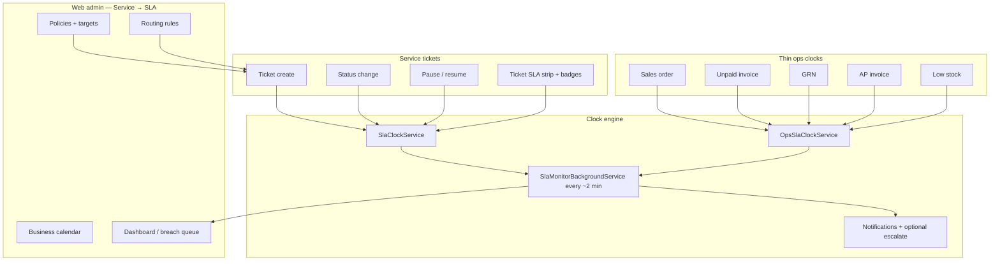
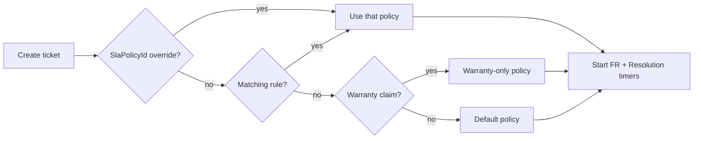
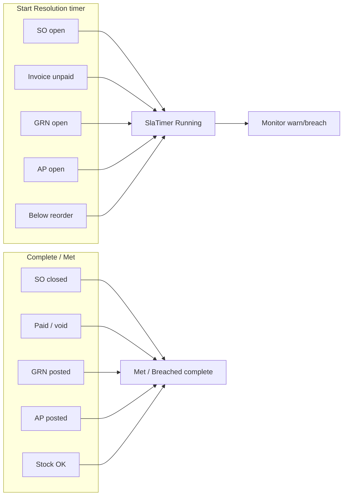

# SLA flows — complete guide (as implemented)

**Audience:** owners, support, and developers who need the full picture of every SLA path Cap runs today.  
**Related:** [SLA-LOOP.md](SLA-LOOP.md) · [SLA-COMPLETE-LOOP.md](SLA-COMPLETE-LOOP.md) · [SLA-EXPANSION.md](SLA-EXPANSION.md) · [PRODUCT-POSITIONING.md](PRODUCT-POSITIONING.md)

**Scope lock:** SLA is **Web Service module admin** (not WPF/POS). Timers run on **service tickets** (full FR + Resolution) plus **thin ops clocks** on selected docs only. No clocks on POS lines, journals, or every stock adjust.

---

## 1. Big picture

| Layer | Role |
|-------|------|
| **Policy** | Named targets (minutes + warn %) by priority / metric / entity type |
| **Rule** | Routes a new ticket to a policy (multi-pipeline) |
| **Timer** | One running clock per entity + metric (`SlaTimer`) |
| **Event** | Audit trail (`Started`, `Paused`, `Warned`, `Breached`, `Met`, …) |
| **Monitor** | Background sweep: warn → breach → notify → escalate (tickets) |

---

## 2. Domain building blocks

### 2.1 Entity types (`SlaEntityType`)

| Value | Meaning | Metrics used |
|-------|---------|--------------|
| `ServiceTicket` (0) | Service Light ticket | First response + Resolution |
| `SalesOrder` (1) | Open / confirmed SO age | Resolution only |
| `SalesInvoice` (2) | Posted unpaid invoice | Resolution only |
| `GoodsReceiptNote` (3) | Draft / QC-hold GRN | Resolution only |
| `PurchaseInvoice` (4) | Draft / unmatched AP | Resolution only |
| `InventoryLowStock` (5) | Product+warehouse below reorder | Resolution only |

### 2.2 Metrics & timer status

| Metric | Ticket meaning | Ops meaning |
|--------|----------------|-------------|
| **First response** | Time until Open → In progress | Not used |
| **Resolution** | Time until Resolved / Closed | Age until doc is cleared |

| Status | Meaning |
|--------|---------|
| `Running` | Clock ticking |
| `Paused` | Frozen (tickets only — waiting on customer / parts / other) |
| `Met` | Completed within target |
| `Breached` | Past target (sticky until completed) |
| `Cancelled` | Abandoned (e.g. closed without first response) |

### 2.3 Core tables

- `SlaPolicy` — name, default flag, calendar mode, warranty-only, **AppliesToEntityType**, escalate user  
- `SlaTarget` — per policy: metric + priority → target minutes + warn %  
- `SlaPolicyRule` — ticket routing (priority / customer type / customer / warranty + sort order)  
- `SlaTimer` — polymorphic clock: `EntityType` + `EntityId` (+ optional `ServiceTicketId`)  
- `SlaEvent` — audit  
- `BusinessCalendar` — timezone, work intervals JSON, holidays JSON  

---

## 3. Service ticket SLA (full loop)

### 3.1 Policy attach on create

**Trigger:** `ServiceTicketService.CreateTicketAsync` → `SlaClockService.OnTicketCreatedAsync`.

**Resolution order:**

1. **Manual override** — ticket create sends `SlaPolicyId` (Web: manage users see “SLA policy (auto)” select).
2. Else **first matching active rule** on ticket policies (`SortOrder` ascending): optional match on priority, customer type, customer id, warranty flag.
3. Else if **warranty claim** → policy with `ApplyToWarrantyOnly`.
4. Else company **default** ticket policy (`IsDefault` + `AppliesToEntityType = ServiceTicket`).

**What starts:** two timers (First response + Resolution) for the ticket’s priority targets.  
Timer keys: `EntityType=ServiceTicket`, `EntityId=ticket.Id`, `ServiceTicketId=ticket.Id`.

### 3.2 Status-driven clock lifecycle

**Trigger:** `ChangeStatusAsync` → `OnTicketStatusChangedAsync`.

| Transition | Effect |
|------------|--------|
| **Open → In progress** | First-response timer **Met** (or stays Breached if already past target) |
| **→ Resolved / Closed** | Open FR timers **Cancelled**; Resolution timer **Met** (or completed as Breached if already breached) |

`DueAt` on the ticket is a **manual hint only** — it does not drive the SLA engine.

### 3.3 Pause / resume

| Action | Who | Effect |
|--------|-----|--------|
| **Pause** | `service.manage` | Running timers → Paused; reasons: Waiting on customer / parts / Other |
| **Resume** | `service.manage` | Paused → Running; elapsed continues from frozen value |

Cannot pause on Resolved/Closed tickets.

### 3.4 Warn → breach → escalate (monitor)

**Hosted service:** `SlaMonitorBackgroundService` — first delay ~30s, then every **~2 minutes**.

For each **Running** timer (tickets + ops):

1. Compute live elapsed (Always-on or Business hours via calendar).
2. If elapsed ≥ warn seconds and not yet warned → set `WarnedAt`, event, **notification**.
3. If elapsed ≥ target → status **Breached**, event, **notification**.
4. **Ticket only:** if policy has `EscalateToUserId`, reassign ticket assignee and notify.

Breach history is sticky (`BreachedAt` kept even when later completed).

### 3.5 Ticket UI surfaces

| Screen | What you see |
|--------|----------------|
| `/service/tickets` | List badges (Warning / Breached); optional policy override on create; SLA filter |
| `/service/tickets/{id}` | SLA strip (remaining, pause/resume) |
| `/m/service` | Compact remaining text |
| Customer 360 | Ticket SLA badges |
| Dashboard | Open breach / warn KPIs → links to SLA |

---

## 4. Multi-pipeline (Service rules)

**Admin:** `/service/sla` → select a **Service ticket** policy → **Rules**.

| Rule field | Match |
|------------|-------|
| Priority | Ticket priority (or any) |
| Customer type | Walk-in / Regular (or any) |
| Customer id | Exact customer (optional) |
| Is warranty claim | Yes / No / any |
| Sort order | Lower runs first |
| Active | Ignored if off |

**API:** `GET/POST/PUT/DELETE /api/service/sla/policies/{id}/rules`  
Rules apply **only** to `AppliesToEntityType = ServiceTicket`.

**Dashboard:** compliance % **per policy** (30-day Met / completed FR and Resolution).

---

## 5. Thin ops clocks (selected docs)

Ops clocks reuse the same timer math with **Resolution** only. Default policies are auto-seeded per company:

| Entity | Default policy name | Default target | Start | Complete |
|--------|---------------------|----------------|-------|----------|
| Sales order | Open sales order age | **3 days** | SO opened / confirmed (open) | Delivered / invoiced / cancelled path closes SO |
| Sales invoice | Unpaid invoice age | **7 days** | Invoice created unpaid | Paid or voided (`PaymentPostingService`) |
| GRN | Stuck GRN age | **2 days** | GRN created (draft/QC) | Posted / cancelled / QC released+posted |
| AP invoice | Stuck AP invoice age | **5 days** | AP invoice created | Posted matched / cancelled |
| Low stock | Low stock reorder | **2 days** | Monitor / receive detects qty &lt; min/reorder | Stock replenished clears timer |

**Hook owners:**

- `EnterpriseSalesService` — SO open/close, invoice unpaid on create from SO  
- `PaymentPostingService` — invoice paid  
- `EnterpriseInventoryService` — GRN open/close + low-stock sync after post  
- `EnterprisePurchaseService` — AP open/close  
- `SlaMonitorService.SweepAsync` — always calls `SyncLowStockAsync` first  

**Low-stock entity id:** `ProductId * 100000 + WarehouseId` (one timer per product/warehouse alert).

### 5.1 Ops UI surfaces

| Screen | Badge source |
|--------|----------------|
| `/sales-orders` | `GET /api/service/sla/alerts?entityType=1` |
| `/invoices` | `entityType=2` |
| `/grn` | `entityType=3` |
| `/ap-invoices` | `entityType=4` |
| `/service/sla/breaches` | Filter by entity type + policy; deep-links to docs |
| `/service/sla` | Filter policies by entity type; edit ops targets |

---

## 6. Business calendar

- One calendar per company (`BusinessCalendar`).
- Policy `CalendarMode`: **Always on (24×7)** or **Business hours**.
- Work intervals + holidays as JSON (default Asia/Karachi Mon–Sat style seed).
- Elapsed / warn / breach use `SlaBusinessHoursCalculator` when mode is Business hours.

**Admin:** `/service/sla` → Business calendar card.  
**API:** `GET/PUT /api/service/sla/calendar`.

---

## 7. Permissions

| Permission | Capability |
|------------|------------|
| `service.view` | Breach queue, dashboard KPIs, ticket SLA strip (read), ops badges |
| `service.manage` | Policies, rules, calendar, pause/resume, policy override on create, set default |

Ops policy CRUD stays under **service.manage** (no new permission codes).

---

## 8. API map (`/api/service/...`)

| Method | Path | Purpose |
|--------|------|---------|
| GET | `tickets/{id}/sla` | Ticket SLA summary |
| POST | `tickets/{id}/sla/pause` | Pause |
| POST | `tickets/{id}/sla/resume` | Resume |
| GET | `sla/policies?entityType=` | List policies |
| POST/PUT | `sla/policies` | Upsert policy + targets |
| POST | `sla/policies/{id}/default` | Set default ticket policy |
| GET/POST/PUT/DELETE | `sla/policies/{id}/rules` | Routing rules |
| GET/PUT | `sla/calendar` | Business calendar |
| GET | `sla/dashboard?entityType=` | KPIs + ByPolicy |
| GET | `sla/breaches?entityType=&policyId=` | Open breaches |
| GET | `sla/alerts?entityType=` | Warn/breach chips for lists |
| GET | `sla/smoke` / `smoke` | Health smoke |

---

## 9. Notifications (in-app)

| Event | Typical title |
|-------|----------------|
| Warn | SLA warning |
| Breach | SLA breached |
| Escalate (ticket) | SLA escalated — open ticket |

Related entity type on notification: `ServiceTicket` or ops `SlaEntityType` name. CRM **DueAt warn** is **separate** — not `SlaPolicy`.

---

## 10. End-to-end scenarios (checklist)

### A. Happy-path ticket

1. Admin sets default policy targets (e.g. High FR 30m / Res 4h, warn 80%).  
2. User creates ticket (auto policy) → two Running timers.  
3. User moves Open → In progress → FR **Met**.  
4. User Resolves → Resolution **Met**.  
5. Dashboard FR/Resolution met % updates (30-day window).

### B. Multi-pipeline

1. Create policy “High warranty pipeline” + rule: Priority=High, Warranty=Yes, SortOrder=1.  
2. Create High warranty ticket → attaches that policy.  
3. Create Normal non-warranty → default policy.

### C. Warn / breach / escalate

1. Short target (test) or wait for monitor.  
2. At warn % → Warning badge + notification.  
3. Past target → Breached + notification; escalate reassigns if configured.  
4. Resolve ticket → timer completes; breach history retained.

### D. Pause

1. On ticket detail, Pause (Waiting on parts).  
2. Elapsed freezes; monitor does not advance paused clocks.  
3. Resume → clock continues.

### E. Ops unpaid invoice

1. Create/confirm SO → invoice unpaid → Resolution timer starts.  
2. Leave unpaid past target → warn/breach on `/invoices` badge + breach queue.  
3. Post payment → timer **Met**.

### F. Low stock

1. Product qty on hand &lt; minimum/reorder → monitor starts low-stock timer.  
2. Receive/adjust stock above threshold → timer cleared (**Met**).

---

## 11. What is deliberately not an SLA flow

| Area | Notes |
|------|--------|
| POS checkout line items | No timers |
| General journals / GL | No timers |
| Every inventory adjustment | Only low-stock alert path |
| WPF / POS desktop | No SLA UI or admin |
| CRM leads / opportunities | Not SLA; activities have thin DueAt warn only |
| Customer portal | Not shipped |
| Full ServiceNow / Salesforce builders | Not claimed |

---

## 12. Code map (for developers)

| Piece | Location |
|-------|----------|
| Domain | `Domain/Entities/SlaEntities.cs`, `SlaEntityType` in enums |
| Ticket clocks | `Application/Services/SlaClockService.cs` |
| Ops clocks | `Application/Services/OpsSlaClockService.cs` |
| Policies / rules / dashboard | `Application/Services/SlaPolicyService.cs` |
| Monitor | `SlaMonitorService` + `Infrastructure/.../SlaMonitorBackgroundService.cs` |
| Ticket hooks | `ServiceTicketService` create / status |
| Ops hooks | `EnterpriseSalesService`, `EnterpriseInventoryService`, `EnterprisePurchaseService`, `PaymentPostingService` |
| API | `Api/Controllers/ServiceController.cs` `/sla/*` |
| Web | `/service/sla`, `/service/sla/breaches`, ticket pages, SO/invoice/GRN/AP badges |

---

*Document version: 2026-08-07 — reflects Light SLA + expansion 1A/2C as shipped in Cap.*
